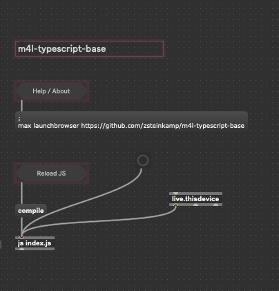

- make a `compile()` function; see https://docs.cycling74.com/legacy/max8/refpages/js#compile
	- note: you can use this, it's reserved
- Instead, see this step from #Tutorial by [[Person/Adam Murray]] in [[Person/Adam Murray/Web/Max for Live]]: [JavaScript in Ableton Live: The Live API - Adam Murray's Blog](https://adammurray.link/max-for-live/js-in-live/live-api/)
	- it should be more like this, using [[c74/M4L/obj/live.thisdevice]]
		- 
		- 
		-
	-