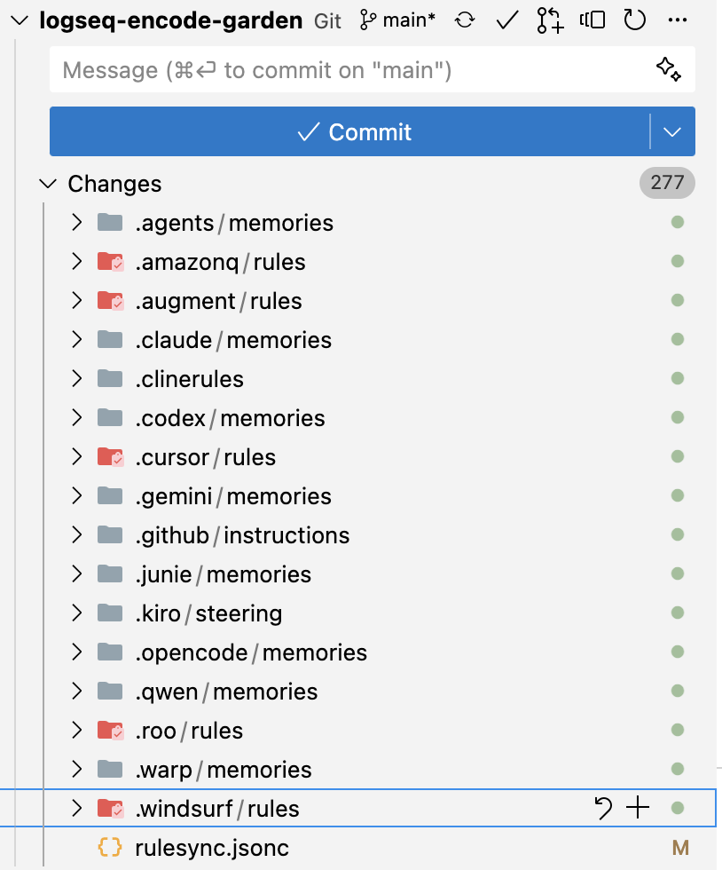

## [[rulesync]] - [[My Notes]] (reverse cron)
	- ### [[2025-10-04 Sat]] - [[git/.gitignore]] issues
	  id:: 68e0f877-fcfc-438c-a9d8-a9d625d68232
		- Yesterday I discovered that the [[rulesync/gitignore]] command implies a usage of rulesync in which the configuration files for any given tool are treated as compiled build artifacts. I was curious about trying out this workflow, so I ran it, which added a bunch of rules to `.gitignore` for each [[AI/Coding/Tool]] - [[CursorAI]], [[Claude Code]], etc.
		- Today, on another computer I discovered the classic problem with introducing [[git/.gitignore]] rules after some subset of files have been tracked to the repo. I asked Claude Code about it.
			- #### [[AI/Response]]
				- The `.gitignore` patterns (lines 24-25 and 29-31) will only prevent untracked files from being added, but they don't affect files that are already in the git repository.
				- Here's what happened:
					- 1. These files were previously committed to your repository
					- 2. When you ran rulesync generate, it modified these already-tracked files
					- 3. Git shows them as modified because they're already being tracked
					- 4. The `.gitignore` patterns don't apply to files already in git's tracking
				- To fix this, you have two options:
					- **Option 1**: Remove these files from git tracking (recommended if you want rulesync to manage them independently):
						- `git rm --cached .cursor/rules/*.mdc .github/instructions/*.instructions.md CLAUDE.md .claude/memories/*.md`
					- **Option 2**: Keep them tracked and commit the changes (if you want these in version control):
						- `git add .cursor/rules/ .github/instructions/ CLAUDE.md .claude/memories/
						  git commit -m "chore: update generated AI tool rules"`
			- So, what do I want to do?
				- #### Option 1 - Remove AI configuration files in repo
					- ###### Pros
						- Some [[Search]] tools (like [[PyCharm]]) can respect [[git/.gitignore]], and it would be convenient to not pollute the search space with a bunch of duplicate information.
						- It will be clearer to AI coding tools that respect gitignore which are the "canonical" versions of the files, which will be particularly useful in the common use case of asking AI tools to updating AI rules files.
					- ##### Cons
						- Sometimes when I talk to people about how I accomplish certain things with AI, it's helpful to be able to hyperlink them to the exact prompt I use, and for many, it would be less confusing if that rule were in the format that they know.
						- I have to regenerate them regularly, which implies running them in a post-checkout hook.
				- #### Option 2 - Keep AI configuration files in repo
					- ##### Pros
						- No need to regenerate them each time; one would regenerate every time a rule is updated, and then commit the changes
						- I can refer coders (be they human or AI) to a file in github that has the version of my rule in their framework of choice.
					- ##### Cons
						- Often times I update AI configuration files in the middle of a task. Explaining to AI how to carefully stage only the items related to an AI configuration change when the git stage is dirty might be tricky and unreliable.
			- I ended up filing [[rulesync/GitHub/Issue/25/10/Feature request rulesync githook]]
	- ### [[2025-09-29 Mon]]
		- I tried running it in [[Person/codekiln/GitHub/logseq-cursor-rules]] in the root directory with ` rulesync import --targets cursor` and it didn't load any, because they were in the root of the directory. There's a [[GitHub/Issue]] for this here: [rulesync import ignores subdirectories in .cursor/rules · Issue #56 · dyoshikawa/rulesync](https://github.com/dyoshikawa/rulesync/issues/56).
		- I also tried running it in [[GitHub/codekiln/logseq-encode-garden]], which did have non-nested [[CursorAI/Project Rules]], but it did not import any rules, as far as I can tell, nor did it output any debug information.
		- As a result, I think this project is of limited utility at this time.
		- I filed [[GitHub/Issue]] [rulesync import --targets cursor does not import .cursor/rules/*.mdc · Issue #328 · dyoshikawa/rulesync](https://github.com/dyoshikawa/rulesync/issues/328)
		- result of running `rulesync generate --targets "*" --features "*" after importing` - ALL the [[AI/Coding/Tool]]s had rules imported!
			- 
		- Again, this made me think that we need [[Package Management]] for [[Knowledge Gardens]], because what if we wanted to share some rules in multiple repositories. It does make me wonder if I need to just make my own MCP server which would be a gateway MCP server.
			- #Filed [[GitHub/Issue/My]]
				- [Brainstorm needed - how to share some rules across repos, but not all · Issue #329 · dyoshikawa/rulesync](https://github.com/dyoshikawa/rulesync/issues/329)
					- Each project usually requires a combination of shared and project-specific rules.
					- For example, some of my projects use rules and commands that are specific to the context of FastAPI. Others, use rules and commands specific to the context of typescript CLIs. I don't need all of my rules and commands in each project.
					- Ideally, it would be possible to define my rules for technology A, e.g. FastAPI, in one repo, my rules for technology B, e.g. TypeScript in another repo, and my rules for technology C, e.g. EnterprisePrivateTechnology in another private repo, and just marshal those rules into the current repo and then use `rulesync` to spread those out to the various providers.
					- One possible solution could be to use git submodules, but those may have problems:
					- in CI, if you have private repos, authentication permissions can get tricky with git submodules.
					- it's not clear that rulesync would support subdirectories needed for git submodules
					- So, let's talk about what possible solutions are out there for this use case.
				- [Feature request: pre-made rules for how AI can use rulesync · Issue #330 · dyoshikawa/rulesync](https://github.com/dyoshikawa/rulesync/issues/330)
					- In order for AI to aid in updating rules, AI needs the context of how `rulesync` works. It would be great if there was an [llms.txt with docs for AI](https://llmstxt.org/) or some other facility for instruction AI on how to update rulesync rules, and what the syntax is for the frontmatter.
					- Is it expected that a rulesync user will edit rules in the AI tool of their choice, then re-import them? Or is the target use case for those who wish to import and thereafter maintain `.rulesync/rules/*.md`?